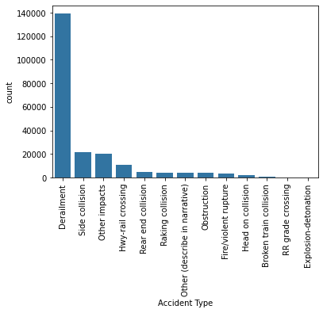
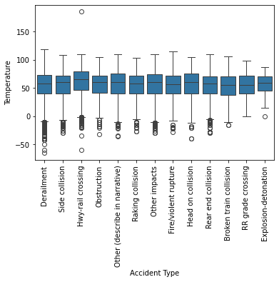
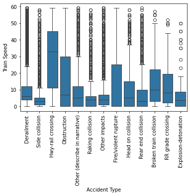
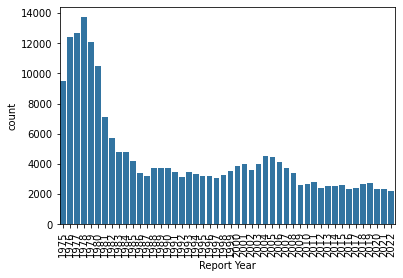
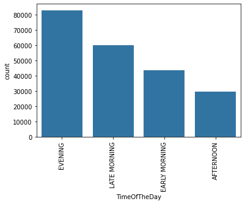

## Data Analysis & Visualizations

The following visualizations were generated as part of the exploratory data analysis (EDA) to identify patterns and relationships within railway accident data.

### Key Insights

- **Accident Type Distribution**  
    
  Shows the frequency of different accident types.

- **Accident Type vs Temperature**  
    
  Analyses how environmental temperature relates to accident occurrences.

- **Accident Type vs Train Speed**  
    
  Examines the relationship between train speed and accident types.

- **Accidents Over Time (Yearly Trends)**  
    
  Displays accident frequency trends over the years.

- **Accidents by Time of Day**  
    
  Highlights patterns based on time periods (morning, night, etc.).
